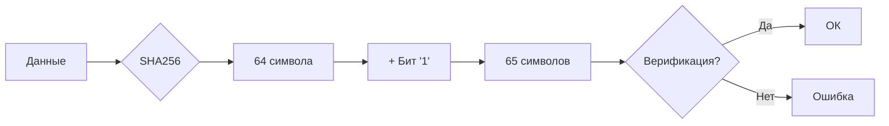

# sha256plus1
> Немного магии поверх обычного SHA256. Добавил один бит для хорошего настроения (и UTF-8 совместимости).

[](https://golang.org)
[](https://opensource.org/licenses/MIT)
[](https://goreportcard.com/report/github.com/yaayex/sha256plus1)
[](#-тесты)
[](https://pkg.go.dev/github.com/yaayex/sha256plus1)

## 🤔 Чего не хватило обычному SHA256?

Всего одного бита. Вроде бы мелочь, но теперь хеши становятся **65 символов** (64 от SHA256 + `1`). Это делает их чуть более уникальными для UTF-8 строк и просто красивее в логах.

## ✨ Что умеет?

- **Просто:** Подключил и забыл. API минималистичный.
- **Безопасно:** Можно пускать в горутины, ничего не упадет.
- **Быстро:** Параллельно хеширует кучу данных сразу.
- **Умнее:** Проверяет целостность и отдает метаданные.

## 🚀 Установка

```bash
go get github.com/yaayex/sha256plus1
```

## 🧪 Быстрый старт

Вот как это работает на практике:

```go
package main

import (
	"fmt"
	"github.com/yaayex/sha256plus1"
)

func main() {
	// Создаем наш волшебный хешер
	hasher := sha256plus1.New()

	// Хешируем строку
	hash := hasher.HashString("Привет, мир!")
	fmt.Println("Хеш:", hash)

	// Проверяем, что мы не перепутали данные
	if hasher.VerifyHashString("Привет, мир!", hash) {
		fmt.Println("✅ Всё ок, данные целы")
	} else {
		fmt.Println("❌ Ой, что-то пошло не так")
	}
}
```

## 🛠 API (кратко)

| Метод | Что делает |
| :--- | :--- |
| `New()` | Создает экземпляр хешера. |
| `Hash(data []byte)` | Хешит байты. Возвращает 65 символов. |
| `HashString(s string)` | Хешит строку. Удобно для текста. |
| `VerifyHash(...)` | Проверяет, совпадает ли хеш с данными. |
| `BatchHash(...)` | Хезит много данных сразу (в параллель). |
| `HashWithMetadata(...)` | Возвращает хеш + инфу о размере и алгоритме. |

## 📊 Как это выглядит «под капотом»?



## 🧪 Тесты и бенчмарки

Запускаем тесты:
```bash
go test -v
```

Запускаем замеры:
```bash
go test -bench=. -benchmem
```

## 📝 Формат хеша

Стандартный SHA256 + наш фирменный бит:
```
a665a45920422f9d417e4867efdc4fb8a04a1f3fff1fa07e998e86f7f7a27ae31
                                                                    ↑
                                                                    Вот этот бит
```

## 🤝 Вклад

Любые PR и ишьюсы приветствуются. Если нашли баг — скидывайте, исправим. Если есть идея — пишите, обсудим.

## 📄 Лицензия

MIT — делай что хочешь, только не ссылайся на меня, если что-то сломается. 😉

---
*Сделано с любовью к хешам от [Yaayex](https://github.com/Yaayex)*
